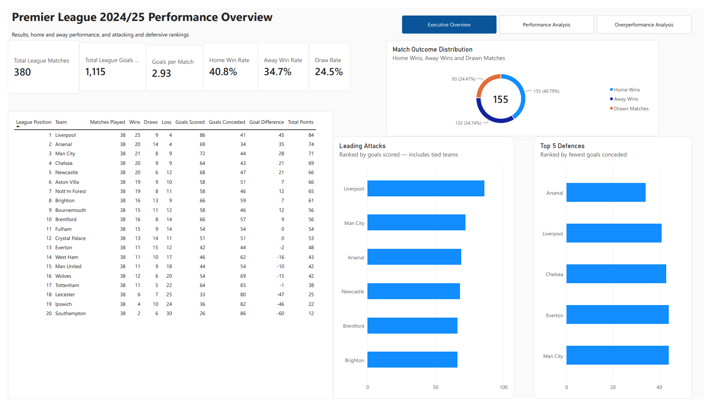
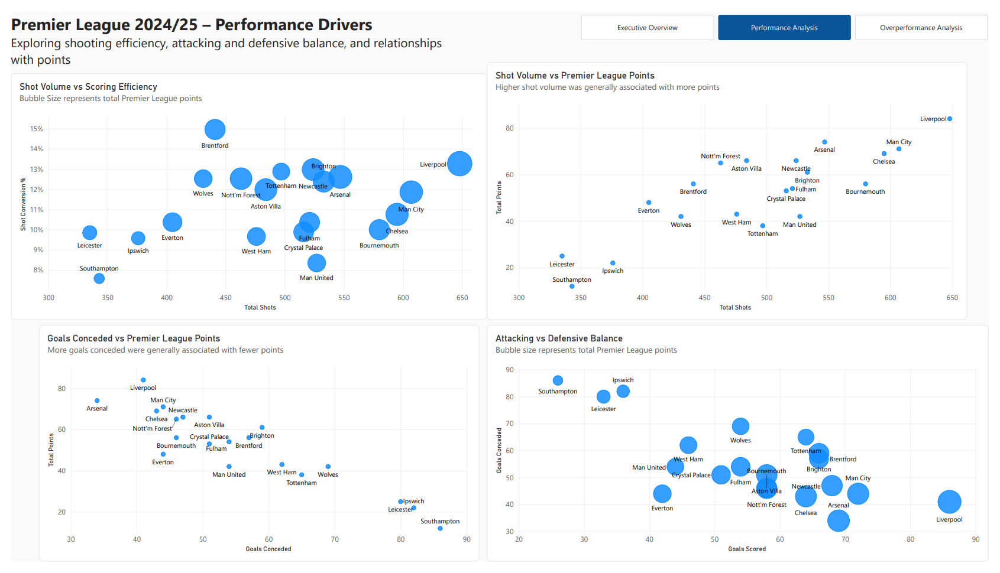
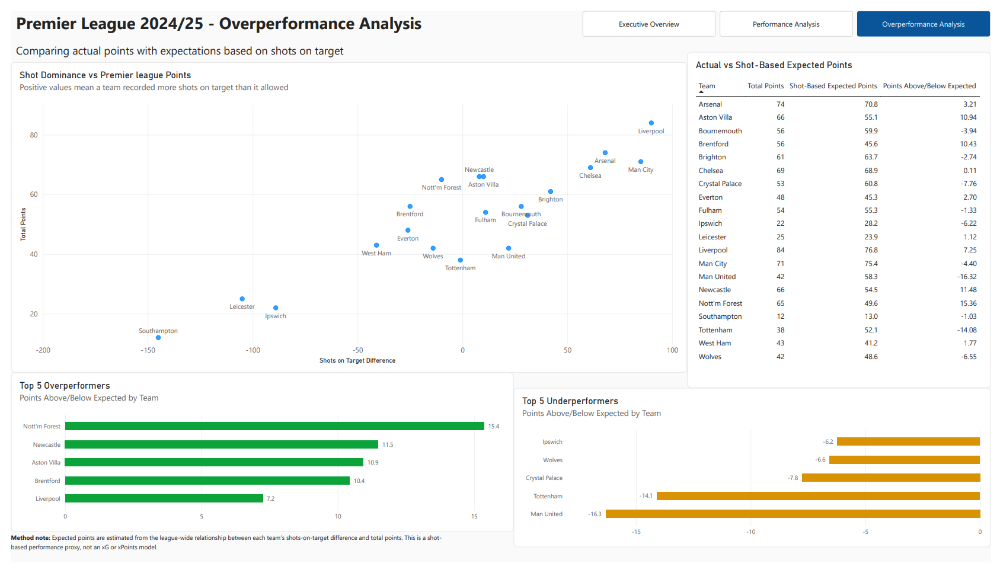

# Premier League 2024/25 Performance Analysis

A Power BI portfolio project investigating which performance factors were most strongly associated with Premier League points in 2024/25, and which teams performed better or worse than their underlying shooting statistics suggested.

## Dashboard Preview

## Questions Explored

- Which attacking and defensive factors were most strongly associated with league points?
- Which teams combined strong attacking output with strong defensive performance?
- How did shot volume and shooting efficiency differ across teams?
- Which teams earned more or fewer points than expected from their shots-on-target difference?

## Performance Analysis

This page explores shot volume, scoring efficiency, attacking and defensive balance, and the relationship between key performance factors and league points.

## Overperformance Analysis

This page compares each team’s actual points with the points expected from its shots-on-target difference. Positive values indicate teams that exceeded the shot-based expectation, while negative values indicate teams that finished below it.

## Data Preparation

The original dataset contained 380 rows, with one row representing each Premier League match. Home and away statistics were stored in separate columns.

Using Power Query, I transformed the data into a team-match table with one row per team per match. This produced 760 rows and allowed the same measures to calculate performance consistently across home and away fixtures.

I validated the transformation by confirming that:

- All 20 teams were present.
- Every team played 38 matches.
- The dataset contained 380 distinct matches.
- Calculated points matched the final league table.
- No required columns contained errors or missing values.

## Tools and Techniques

- Power BI Desktop
- Power Query for cleaning, reshaping and appending data
- DAX measures for league results, shooting metrics and expected-points estimates
- Pearson correlation analysis
- Simple linear regression
- Data validation and report interaction testing
- Dashboard design and page navigation

## Overperformance Method

Because the dataset did not include expected-goals or expected-points data, I used shots-on-target difference as a transparent proxy for underlying performance.

**Shots-on-target difference = shots on target created − shots on target allowed**

I fitted a simple linear relationship between shots-on-target difference and total points across the 20 teams. A team’s overperformance or underperformance was then calculated as:

**Points above/below expected = actual points − shot-based expected points**

This is a learning model rather than an official xPoints model.

## Key Findings

- Goals conceded had the strongest relationship with league points (`r = -0.91`). Teams generally earned fewer points as they conceded more goals.
- Goals scored also had a strong relationship with points (`r = 0.89`), followed by total shots (`r = 0.83`).
- Liverpool finished first with 84 points and led the league in both home points (46) and away points (38).
- Brentford recorded the highest shot-conversion rate at 14.97%.
- Nottingham Forest finished 15.36 points above the shot-based expectation.
- Manchester United finished 16.32 points below the shot-based expectation.

## Limitations

- The analysis covers one season and only 20 teams, so the relationships may not remain the same across other seasons.
- Correlation shows association, not causation.
- Shots-on-target difference treats all shots on target equally and does not account for chance quality, shot location, goalkeeper performance or other match circumstances.
- The expected-points measure is a simple portfolio model and should not be interpreted as official xG or xPoints data.

## Repository Files

- [Power BI project file](Premier_League_2024_25_Performance_Analysis.pbix) — interactive report for use in Power BI Desktop
- [Exported report](Premier_League_2024_25_Performance_Analysis.pdf) — static three-page PDF version
- [Project journal](project-journal.pdf) — project decisions, validation checks and learning notes
- [Source dataset](season-2425.csv) — original match-level data
- `executive-overview.png` — Executive Overview screenshot
- `performance-analysis.png` — Performance Analysis screenshot
- `overperformance-analysis.png` — Overperformance Analysis screenshot
